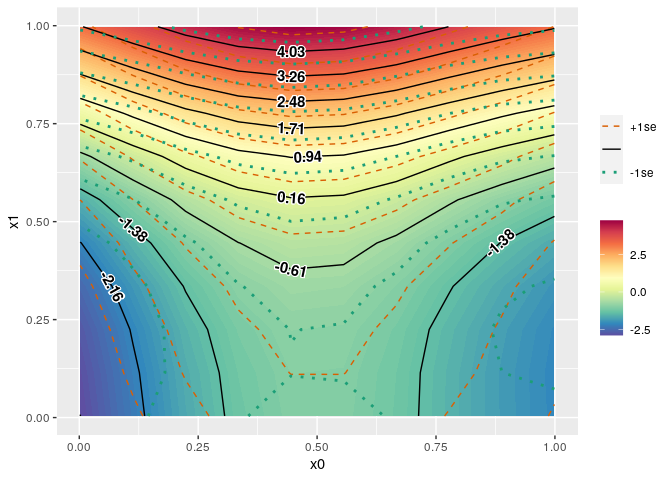

<!-- README.md is generated from README.Rmd. Please edit that file -->

# gamutil

<!-- badges: start -->

[](https://github.com/msaito8623/gamutil/actions)
<!-- badges: end -->

The goal of gamutil is to provide some short-cut functions to facilitate
to work with mgcv::gam and mgcv::bam.

## Installation

You can install the released version of gamutil from
[CRAN](https://CRAN.R-project.org) with:

``` r
install.packages("gamutil")
```

And the development version from [GitHub](https://github.com/) with:

``` r
# install.packages("devtools")
devtools::install_github("msaito8623/gamutil")
```

## Example

This is a basic example which shows you how to visualize prediction by a
GA(M)M model with a contour plot:

``` r
library(gamutil)
library(mgcv)
#> Loading required package: nlme
#> This is mgcv 1.8-34. For overview type 'help("mgcv-package")'.
set.seed(8361)
dat = gamSim(verbose=FALSE)
mdl = gam(y ~ s(x0) + s(x1) + ti(x0,x1), data=dat)
plt = plot_contour(mdl, view=c('x0','x1'))
print(plt)
```


