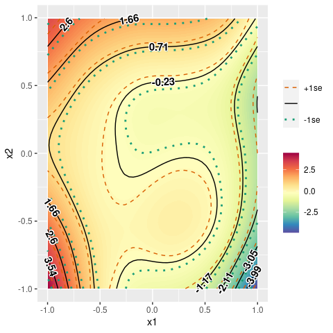
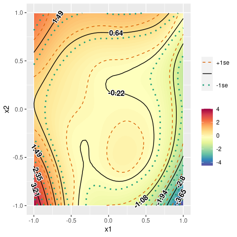
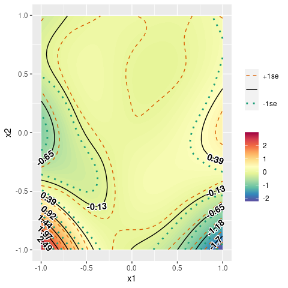
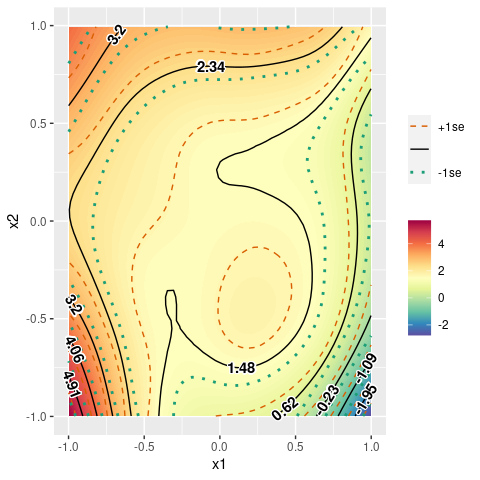
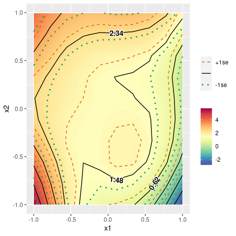
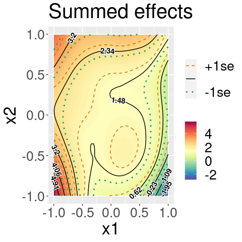

<!-- README.md is generated from README.Rmd. Please edit that file -->

# gamutil

<!-- badges: start -->

[](https://github.com/msaito8623/gamutil/actions)
[](https://lifecycle.r-lib.org/articles/stages.html#experimental)
[](https://app.codecov.io/gh/msaito8623/gamutil?branch=master)
[](https://github.com/msaito8623/gamutil/actions/workflows/R-CMD-check.yaml)
<!-- badges: end -->

This package “gamutil” provides some short-cut functions to facilitate
to work with mgcv::gam and mgcv::bam.

## Installation

You can install the development version of gamutil from
[GitHub](https://github.com/):

``` r
# install.packages("devtools")
devtools::install_github("msaito8623/gamutil")
```

-----

## Examples

### Contour plots from GAM

In the current version, the main function of gamutil is
gamutil::plot\_contour. The function takes a mgcv::gam object and
returns a ggplot object, automating the whole process of making a new
data frame, calculating the model’s predictions, and constructing a
contour plot using ggplot.

``` r
library(gamutil)
library(mgcv)
#> Loading required package: nlme
#> This is mgcv 1.9-0. For overview type 'help("mgcv-package")'.
dat <- gamutil::example_df()
mdl <- gam(y ~ s(x0) + s(x1) + s(x2) + ti(x0, x1) + ti(x0, x2) + ti(x1, x2) + ti(x0, x1, x2), data=dat)
plt <- plot_contour(mdl, view=c('x1','x2'))
print(plt)
```


But there are already several functions available for similar purposes.
For example, there are mgcv::vis.gam and itsadug::fvisgam for
visualizing summed effects. For partial effects, mgcv::plot.gam and
itsadug::pvisgam can be used. There are intermediate cases between
summed effects and partial effects, which I would call “partially-summed
effects”. Partially summed effects refer to the sum of the effects by
only several partial effects.

For example, suppose we are interested in the effects of “x1” and “x2”.
There are several terms containing “x1” and “x2” in the current model
(fitted above). If we visualize summed effects, all the terms would be
included, including those without “x1” or “x2”, for example “s(x)”. In
contrast, if we choose to visualize partial effects, we have to choose
one of the terms that contain “x1” and/or “x2”. How can we specify the
sum of the partial effects of “s(x1)”, “s(x2)”, and “ti(x1,x2)”? It can
be achieved by gamutil::plot\_contour:

``` r
plt <- plot_contour(mdl, view=c('x1','x2'), summed=FALSE, terms.size='medium', verbose=TRUE)
#> Selected:
#> s(x1)
#> s(x2)
#> ti(x1,x2)
print(plt)
```



With “terms.size=‘medium’”, all the terms that contain the variables
specified in “view” but not any other variable would be included. But,
how about “ti(x0,x1)”, “ti(x0,x2)”, and “ti(x0,x1,x2)”? They do contain
uninterested variables (i.e., “x0”). But, they also include the
variables of interest. To include all the terms that contain at least
one variable of interest specified in “view”, you only need to set
“terms.size=‘max’”:

``` r
plt <- plot_contour(mdl, view=c('x1','x2'), summed=FALSE, terms.size='max', verbose=TRUE)
#> Selected:
#> s(x1)
#> s(x2)
#> ti(x0,x1)
#> ti(x0,x2)
#> ti(x1,x2)
#> ti(x0,x1,x2)
print(plt)
```



The other possible value for “terms.size” is “min”, which would plot a
partial-effect plot:

``` r
plt <- plot_contour(mdl, view=c('x1','x2'), summed=FALSE, terms.size='min', verbose=TRUE)
#> Selected:
#> ti(x1,x2)
print(plt)
```



If you need a summed-effect plot, you can set “summed=TRUE”:

``` r
plt <- plot_contour(mdl, view=c('x1','x2'), summed=TRUE, verbose=TRUE)
#> Selected: All (summed effect).
print(plt)
```



-----

### Customizing a contour plot

The argument “axis.len” controls resolution of the contour plot to be
produced (default=50). Bigger numbers for the argument would draw
smoother contour lines.

``` r
plt <- plot_contour(mdl, view=c('x1','x2'), axis.len=10)
print(plt)
```



The interval between contour lines can be adjusted by the
“break.interval” argument.

``` r
plt <- plot_contour(mdl, view=c('x1','x2'), axis.len=100, break.interval=1.5)
print(plt)
```


The return value of gamutil::plot\_contour is a ggplot object.
Therefore, it can be modified in the same way as you would do for ggplot
objects in general. For example, you can change font sizes and a plot
title as below:

``` r
library(ggplot2)
plt <- plot_contour(mdl, view=c('x1','x2'), verbose=TRUE)
#> Selected: All (summed effect).
plt <- plt + theme(text=element_text(size=25))
plt <- plt + labs(title='Summed effects')
plt
```



-----

### Faceting contour plots

If you have a by-variable in some terms in a model, you can produce
contour plots separately for each level of the by-variable.

``` r
set.seed(1234)
dat$fac <- factor(sample(c("A","B"), size=nrow(dat), replace=TRUE))
mdl <- gam(y ~ s(x1, by=fac) + s(x2, by=fac) + ti(x1, x2, by=fac), data=dat)
plt <- plot_contour(mdl, view=c('x1','x2'), cond=list(fac=c("A","B")))
print(plt)
```


Make sure to always specify the level(s) of the by-variable if you have
a by-variable in a model. This is because mgcv::gam would estimate
separate smooths/surfaces for each level of a by-variable. In other
words, there is no intermediate or average smooth or surface in such a
case. As a consequence, if you don’t specify any level of a by-variable,
gamutil::plot\_contour cannot know which level to plot and therefore
produces an error:

``` r
plt <- plot_contour(mdl, view=c('x1','x2'), cond=list())
```

-----

## Acknowledgments

Some functions in this package, especially gamutil::plot\_contour, are
inspired by [mgcv::plot.gam](https://CRAN.R-project.org/package=mgcv),
[itsadug::fvisgam](https://CRAN.R-project.org/package=itsadug), and
[itsadug::pvisgam](https://CRAN.R-project.org/package=itsadug).
