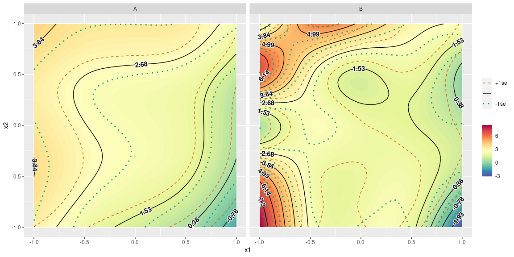
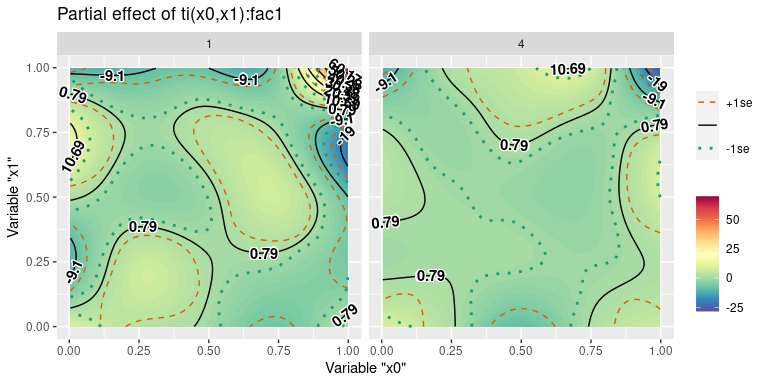

<!-- README.md is generated from README.Rmd. Please edit that file -->

# gamutil

<!-- badges: start -->

[](https://github.com/msaito8623/gamutil/actions)
[](https://lifecycle.r-lib.org/articles/stages.html#experimental)
<!-- badges: end -->

The goal of gamutil is to provide some short-cut functions to facilitate
to work with mgcv::gam and mgcv::bam.

## Installation

gamutil is still under development and therefore not available on
[CRAN](https://CRAN.R-project.org).

The development version is available from [GitHub](https://github.com/)
with:

``` r
# install.packages("devtools")
devtools::install_github("msaito8623/gamutil")
```

## Examples

This is a basic example which shows you how to visualize prediction by a
GA(M)M model with a contour plot:

``` r
library(gamutil)
library(mgcv)
#> Loading required package: nlme
#> This is mgcv 1.9-0. For overview type 'help("mgcv-package")'.
set.seed(8361)
dat = gamSim(verbose=FALSE)
mdl = gam(y ~ s(x0) + s(x1) + ti(x0,x1), data=dat)
plt = plot_contour(mdl, view=c('x0','x1'))
print(plt)
```


-----

The argument “axis.len” controls resolution of the contour plot to be
produced (default=50). Bigger numbers for the argument would draw
smoother contour lines.

``` r
plt = plot_contour(mdl, view=c('x0','x1'), axis.len=10)
print(plt)
```


-----

The interval between contour lines can be adjusted by the
“break.interval” argument.

``` r
plt = plot_contour(mdl, view=c('x0','x1'), axis.len=100, break.interval=1.5)
print(plt)
```


-----

In default, the summed effect is drawn (as the figures above). For
partial effects, summed=FALSE.

``` r
plt = plot_contour(mdl, view=c('x0','x1'), summed=FALSE, axis.len=100)
print(plt)
```


-----

Which terms are selected for the plot? In default, the term that has no
more or less than the variables included in “view”. In this example, the
term to selected is ti(x0,x1). Which terms to be included can be
controlled by “terms.size”. The argument takes “min”, “medium”, or
“max”, and its default value is “min”. Since it selects only one
term, it corresponds to mgcv::plot.gam or itsadug::pvisgam.

Sometimes, not only one term but several terms can be of interest. For
example, the sum of the partial effects of s(x0), s(x1), and ti(x0,x1)
may be of interest, but you would like to exclude s(x2). This choice of
terms can be achieved by terms.size=“medium”, with which the terms that
contain at least one of the variables specified by “view” and “cond”,
excluding other variables.

``` r
plt = plot_contour(mdl, view=c('x0','x1'), summed=FALSE, axis.len=100, terms.size="medium", verbose=TRUE)
#> Selected:
#> s(x0)
#> s(x1)
#> ti(x0,x1)
print(plt)
```



-----

Note that the “by”-variable, which can be specified by “cond”, is also
taken into consideration in search of pertinent terms.

``` r
set.seed(4195)
dat2 = gamSim(eg=6, verbose=FALSE)
#> Gu & Wahba 4 term additive model
mdl2 = gam(y ~ s(x0, by=fac) + s(x1, by=fac) + ti(x0,x1, by=fac), data=dat2)
plt = plot_contour(mdl2, view=c('x0','x1'), cond=list(), summed=FALSE, axis.len=100, terms.size="min", verbose=TRUE)
#> 
#> ###### VERBOSE ######
#> ERROR: No term is matched.
#> 
#> terms = c(x0, x1)
#> terms.size = min
#> Available terms:
#> --> s(x0, by = fac), s(x1, by = fac), ti(x0, x1, by = fac)
#> 
#> Since terms.size=min, the only one term that matches exactly c(x0, x1) was searched.
#> 
#> Did you maybe forget to specify a level of the "by" variable?
#> "by" variables need to be included in "cond".
#> e.g., ti(x0,x1,by=fac)
#> --> view/terms=c("x0","x1"), cond=list(fac="1").
#> 
#> Or maybe did you include unnecessary variables in "cond"?
#> e.g., view/terms=c("x0","x1"), cond=list(fac="1", x2=0.5)
#> --> The terms that also contain "x2" are searched such as ti(x0,x1,x2,by=fac)
#> --> Then ti(x0,x1,by=fac) would be excluded for example when terms.size="min".
#> 
#> I hope this explanation helps!.
#> ###### VERBOSE ######
#> Error in add_fit(ndat, mdl, tms, cond, terms.size, ci.mult, verbose): No term matched.
```

The example above gives an error, complaining there is no term matched.
This is because the function looked for the term that only contains “x0”
and “x1” and not other. But all the terms have “by=fac”. In other words,
in the example above, the function does not know which level of the
factor variable “fac” to use without “cond”.

Telling the function which level of the factor variable to use through
“cond”, the function draws a contour plot for that factor level.

``` r
plt = plot_contour(mdl2, view=c('x0','x1'), cond=list(fac='1'), summed=FALSE, axis.len=100, terms.size="min", verbose=TRUE)
#> Selected:
#> ti(x0,x1):fac1
print(plt)
```


Multiple factor levels can be drawn in separate panels by giving “cond”
a vector of the pertinent factor levels:

``` r
plt = plot_contour(mdl2, view=c('x0','x1'), cond=list(fac=c('1','4')), summed=FALSE, axis.len=100, terms.size="min", verbose=TRUE)
#> Selected:
#> ti(x0,x1):fac1
#> ti(x0,x1):fac4
print(plt)
```


-----

The produced plot is a ggplot object, which means you can modify the
plot as you would usually do for a ggplot object created by
ggplot2::ggplot.

``` r
library(ggplot2)
plt = plot_contour(mdl2, view=c('x0','x1'), cond=list(fac=c('1','4')), summed=FALSE, axis.len=100, terms.size="min", verbose=TRUE)
#> Selected:
#> ti(x0,x1):fac1
#> ti(x0,x1):fac4
plt = plt + xlab('Variable "x0"')
plt = plt + ylab('Variable "x1"')
plt = plt + labs(title='Partial effect of ti(x0,x1):fac1')
print(plt)
```



-----

## Acknowledgments

Some functions in this package, especially gamutil::plot\_contour, are
inspired by [mgcv::plot.gam](https://CRAN.R-project.org/package=mgcv),
[itsadug::fvisgam](https://CRAN.R-project.org/package=itsadug), and
[itsadug::pvisgam](https://CRAN.R-project.org/package=itsadug).
